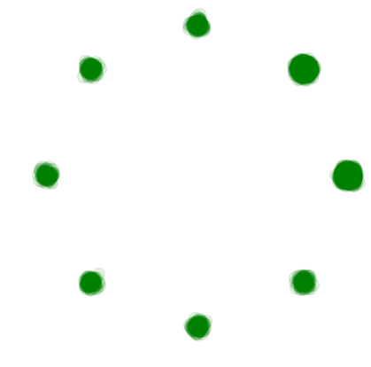
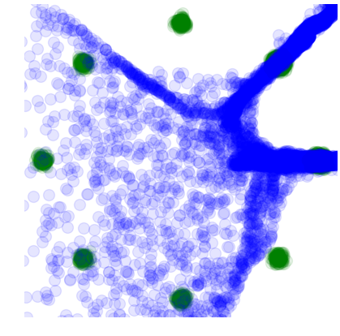
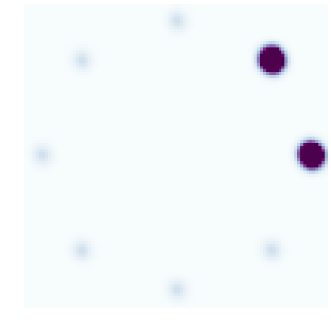
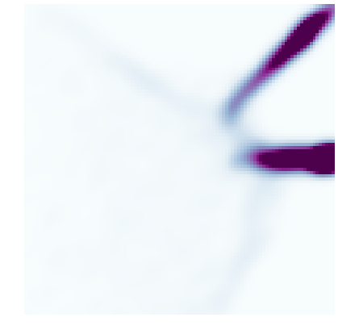
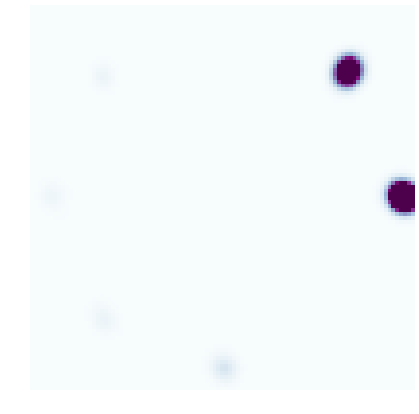
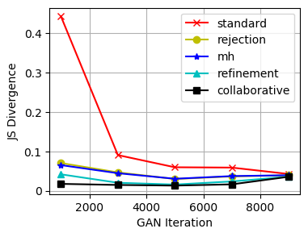
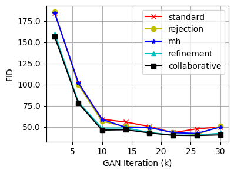
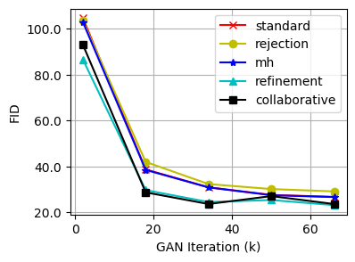

# Collaborative Sampling in Generative Adversarial Networks

This repository provides a TensorFlow implementation of the Collaborative Sampling in Generative Adversarial Networks.

#### [AAAI20](https://arxiv.org/pdf/1902.00813.pdf)  |  [Poster](https://drive.google.com/open?id=1dAO_rptJ7qOhPHVMW_9hS425Wm83LcL8)  |  [PyTorch](https://github.com/YuejiangLIU/pytorch-collaborative-gan-sampling)

<br>

## Overview


Once GAN training completes, we use both the generator and the discriminator to produce samples *collaboratively*. Our sampling scheme consists of one sample proposal step and multiple sample refinement steps. (I) The fixed generator proposes samples. (II) Subsequently, the discriminator provides gradients, with respect to activation maps of the proposed samples, back to a particular layer of the generator. Gradient-based updates of the activation maps are performed repeatedly until the samples are classified as *real* by the discriminator.

<br>

## [2D Synthetic](2D/README.md)

GANs for modelling an *imbalanced* mixture of 8 Gaussians. Vanilla [GANs](https://papers.nips.cc/paper/5423-generative-adversarial-nets) are prone to mode collapse. The accept-reject sampling algorithms including Discriminator Rejection Sampling ([DRS](https://arxiv.org/abs/1810.06758)) and Metropolis-Hastings method ([MH-GAN](https://arxiv.org/abs/1810.06758)) suffer from severe distribution bias due to the mismatch between distribution supports. Our collaborative sampling scheme applied to early terminated GANs succeeds in recovering all modes without compromising sample quality, significantly outperforming the baseline methods.

| Real | GAN <br> 1K Iter | GAN <br> 9K Iter | DRS <br> at 1K Iter | MH-GAN <br> at 1K Iter | Refine <br> at 1K Iter | Collab <br> at 1K Iter |
|:-------------------------:|:-------------------------:|:-------------------------:|:-------------------------:|:-------------------------:|:-------------------------:|:-------------------------:|
| |  |  |  |  |  |  
 |  |  |  |  |  |  |

| Quality | Diversity | Overall |
| ------------- |:-------------:|:-------------:|
 |  |  |

<br>

## [Image Generation](image/README.md)


DCGAN for modelling human faces on the CelebA dataset. (Top) Samples from standard sampling. (Middle) Samples from our collaborative sampling method. (Bottom) The difference between the top and the middle row.

| Cifar10 | CelebA | 
|:-------------:|:-------------:|
| |  |

<br>

## [Image Manipulation](image/README.md)


CycleGAN for unpaired image-to-image translation. (Top) Samples from standard sampling. (Middle) Samples from our collaborative sampling method. (Bottom) The difference between the top and the middle row.

<br>

## Dependencies:
 
- tensorflow==1.13.0
- CUDA==10.0
- pillow
- scipy=1.2
- matplotlib
- requests
- tqdm 

<br>

## Citation:

If you use this code for your research, please cite our papers.

```
@misc{liu2019collaborative,
    title={Collaborative Sampling in Generative Adversarial Networks},
    author={Yuejiang Liu and Parth Kothari and Alexandre Alahi},
    year={2019},
    eprint={1902.00813},
    archivePrefix={arXiv},
    primaryClass={cs.LG}
}
```

## Acknowledgements
The baseline implementation has been based on [this repository](https://github.com/carpedm20/DCGAN-tensorflow)
