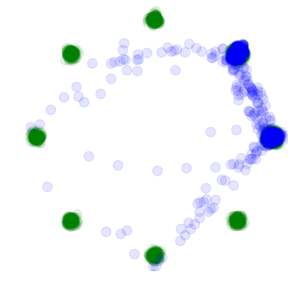
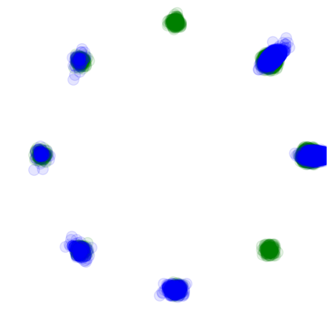
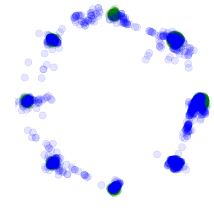
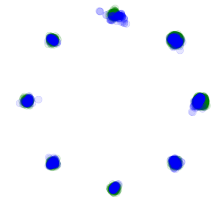
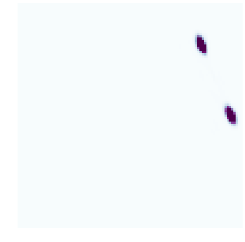
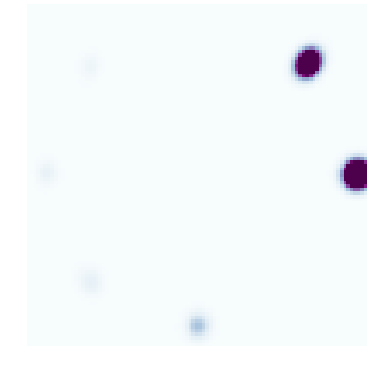
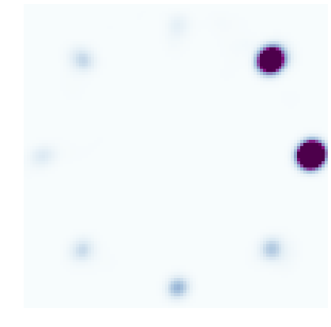
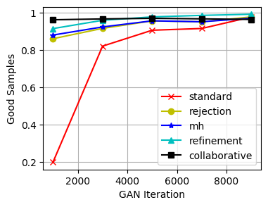
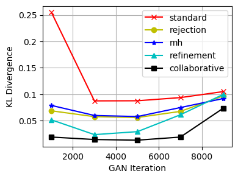
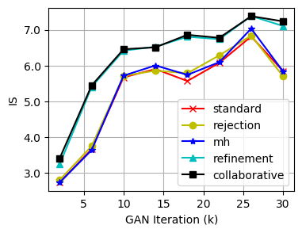

# Collaborative Sampling in Generative Adversarial Networks

This repository contains the code for the paper: 

[Collaborative Sampling in Generative Adversarial Networks](https://arxiv.org/abs/1902.00813)


Once GAN training completes, we use both the generator and the discriminator to produce samples **collaboratively**. Our sampling scheme consists of one sample proposal step and multiple sample refinement steps. (I) The fixed generator proposes samples. (II) Subsequently, the discriminator provides gradients, with respect to activation maps of the proposed samples, back to a particular layer of the generator. Gradient-based updates of the activation maps are performed repeatedly until the samples are classified as *real* by the discriminator.

<br>

## [2D Synthetic](2D/README.md)

Different sampling methods on a synthetic *imbalanced* mixture of 8 Gaussians. Standard GAN training is prone to mode collapse. Our collaborative sampling scheme applied to early terminated GANs succeeds in recovering all modes without compromising sample quality, outperforming the rejection sampling and metropolis-hastings method. 

| Real | [GAN](https://papers.nips.cc/paper/5423-generative-adversarial-nets) <br> 1K Iter | [GAN](https://papers.nips.cc/paper/5423-generative-adversarial-nets) <br> 9K Iter | [DRS](https://arxiv.org/abs/1810.06758) <br> at 1K Iter | [MH-GAN](https://arxiv.org/abs/1810.06758) <br> at 1K Iter | Refine <br> at 1K Iter | Collab <br> at 1K Iter |
|:-------------------------:|:-------------------------:|:-------------------------:|:-------------------------:|:-------------------------:|:-------------------------:|:-------------------------:|
| |  |  |  |  |  |  
 |  |  |  |  |  |  |


| Quality | Diversity | Overall |
| ------------- |:-------------:|:-------------:|
 |  |  |

## [Nature Images](image/README.md)
         

DCGAN on the CelebA. (Top) Samples from standard sampling. (Middle) Samples from our collaboratively sampling method. (Bottom) The difference between the top and middle row images, reflecting the effectiveness of our method in improving the quality of natural images.

| Dataset | IS | FID | 
|:-------------:|:-------------:|:-------------:|
| Cifar10 | |  |
| CelebA | |  |

<br>

## Dependencies:
 
- tensorflow==1.13.0
- CUDA==10.0
- pillow
- scipy=1.2
- matplotlib
- requests
- tqdm 

<br>

## Citation
If you find the codes or paper useful for your research, please cite our paper:
```
@techreport{liu2019collaborative,
  title={Collaborative Sampling in Generative Adversarial Networks},
  author={Liu, Yuejiang and Kothari, Parth Ashit and Alahi, Alexandre},
  year={2019}
}
```

<br>

## Acknowledgements
The baseline implementation has been based on [this repository](https://github.com/carpedm20/DCGAN-tensorflow)
